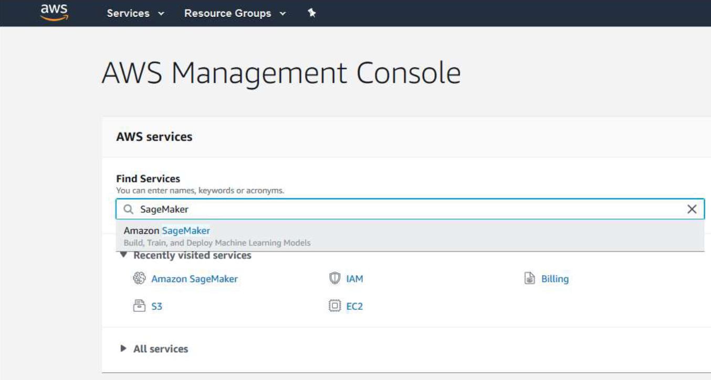

# Cloud SageMaker instruction

This is transparent description of the Sage Maker implementation, which is an AWS cloud computing option

## How to use it

 1. First, you need to create an account on the [Amazon AWS](https://aws.amazon.com/) website.
 2. You should get the money on the account that the students are entitled to.
 3. Go to  [This page](https://us-east-2.console.aws.amazon.com/console/home?region=us-east-2). Then find 'FindServices' option and choose 'Amazon SageMaker'.
 