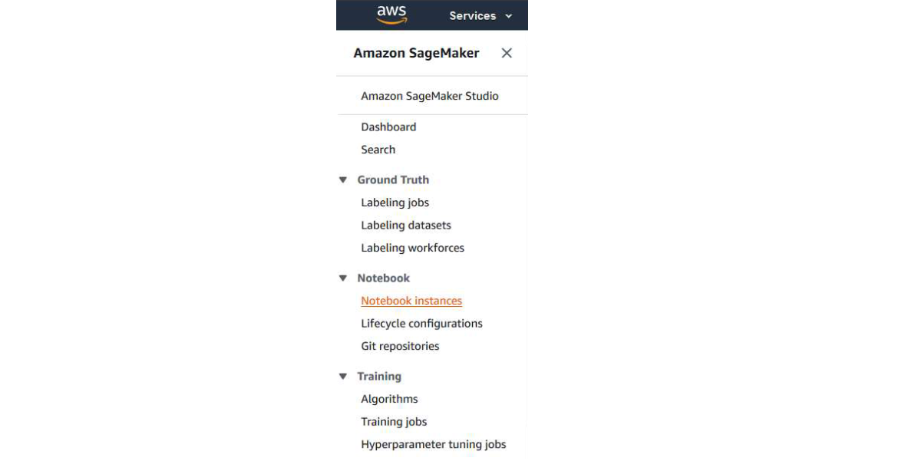

# Cloud SageMaker instruction

This is transparent description of the Sage Maker implementation, which is an AWS cloud computing option.

## How to use it

 1. First, you need to create an account on the [Amazon AWS](https://aws.amazon.com/) website.
 2. You should get the money on the account that the students are entitled to.
 3. Go to  [This Page](https://us-east-2.console.aws.amazon.com/console/home?region=us-east-2). Then find 'FindServices' option and choose 'Amazon SageMaker'.
 
 4. Then, on the left side, select the 'Notebook instances' option and press it.

 

 5. Choose 'Create notebook instance' option and enter the chosen one by you name in 'Notebook instance name'. In this example we choose the option ml.t2.medium z 'Notebook instance type'.
 
 6. Select your user's role in the IAM role window. Choose 'Create a new role'. In the window that pops up, select the option 'Any S3 Bucket' and then 'Create role'.
 
 7. Finally, choose 'Create notebook instance'.
 8. On the Notebook instances page you will see which instance you have 'Pending' status. You have to wait approx. 2 minutes for it to change status from 'Pending' to 'InService'.
 
 9. Choose the Open Jupyter option that appeared on the right side of the instance. Next open a folder where you can store your files or create a new file where you can write a Python program. On the right On the page, select the New option, and then the type of file you are interested in. Most likely it will be conda_python3.
 
 10. Go to [This Page](https://docs.aws.amazon.com/sagemaker/latest/dg/data-prep.html) for tips how to use the SageMaker platform with relevant functions that will be useful, for example, when preparing data, or breakdown of calculations into appropriate machines. 
